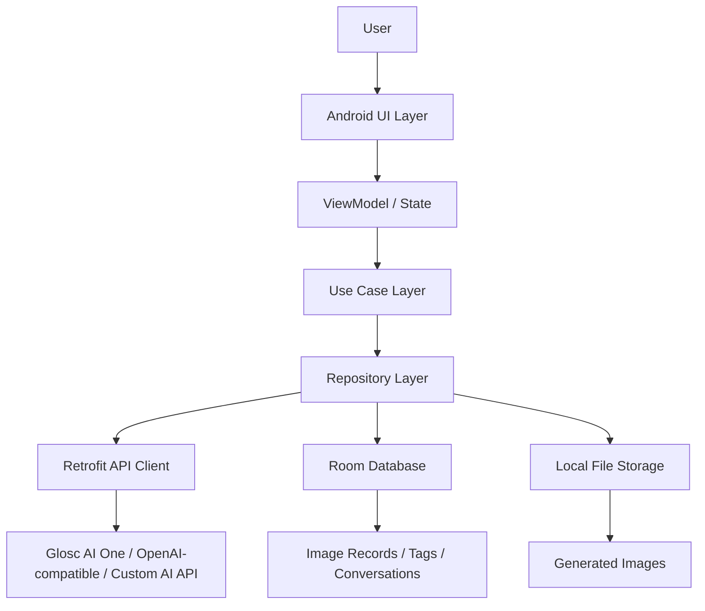
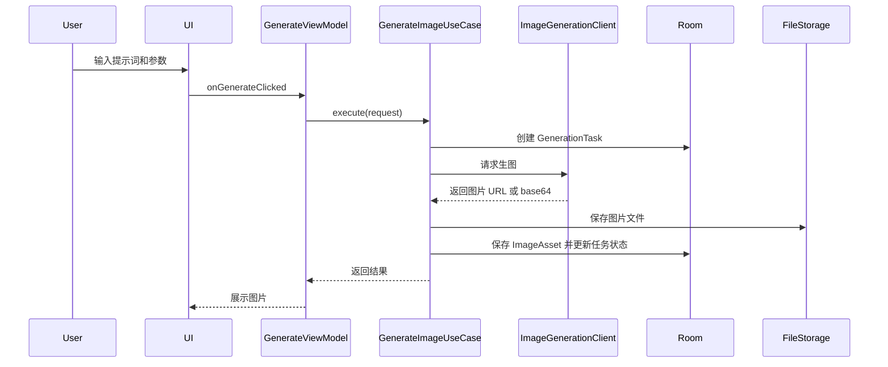

# GloscAI Images APP 设计文档

版本：v0.1  
日期：2026-06-15  
资料来源：README.md

## 1. 设计背景

GloscAI Images APP 是一款 Android 原生 AI 生图应用。README 已明确的技术栈包括 Android 原生开发、OpenAI API、Room、Retrofit 和 Glide。

当前仓库已包含 Android 源码，本文档作为实现参考和后续扩展设计基线。当前实现采用单 `app` module，通过包结构保持 UI、domain、data 和 core 边界。

## 2. 设计目标

- 支持工程式生图、对话式生图、图片编辑、图片变换和图片管理。
- 默认支持 Glosc AI One，同时为 OpenAI 兼容 API、第三方或自建 AI 服务预留适配层。
- 使用 Room 保存图片记录、任务状态、标签、分类和对话记录。
- 使用 Retrofit 统一处理网络请求。
- 使用 Glide 处理图片加载和缓存。
- 保证 API Key、用户图片和提示词数据有基本安全保护。

## 3. 总体架构

当前实现采用分层架构：



### 3.1 UI 层

职责：

- 展示生图、对话、编辑、图片库、设置等界面。
- 管理用户输入和交互状态。
- 观察 ViewModel 状态并渲染 loading、success、error、empty 等状态。

已实现页面：

- 工程式生图页。
- 对话式生图页。
- 图片编辑页。
- 图片库页。
- 图片详情页。
- API 设置页。

### 3.2 ViewModel 层

职责：

- 管理页面状态。
- 调用 Use Case 执行业务操作。
- 将业务结果转换为 UI 可展示状态。
- 避免在 Activity 或 Fragment 中堆积业务逻辑。

### 3.3 Use Case 层

职责：

- 封装单个业务动作，例如生成图片、保存图片、搜索图片、编辑图片。
- 组合网络、数据库和本地文件操作。
- 统一处理异常、任务状态和结果映射。

### 3.4 Repository 层

职责：

- 为业务层提供稳定数据接口。
- 屏蔽 Glosc AI One、OpenAI 兼容 API、自定义 API、Room 和文件存储差异。
- 负责数据源选择、缓存和本地持久化。

### 3.5 Data 层

职责：

- Retrofit 服务定义。
- Room Entity、DAO 和 Database。
- 本地文件保存、读取、删除。
- API Provider 配置管理。

## 4. 模块划分建议

在项目早期可以使用单 app module，通过包结构保持边界：

```text
app/
  ui/
    generate/
    chat/
    edit/
    library/
    settings/
  domain/
    model/
    usecase/
  data/
    api/
    db/
    repository/
    storage/
  core/
    network/
    security/
    image/
    common/
```

当功能复杂度提升后，可拆分为 Gradle 多模块：

- app：应用入口和导航。
- core-network：Retrofit、OkHttp、API Provider。
- core-database：Room 数据库。
- core-storage：图片文件存储。
- feature-generate：工程式生图。
- feature-chat：对话式生图。
- feature-edit：图片编辑和变换。
- feature-library：图片管理。
- feature-settings：API 配置。

## 5. 核心数据模型

### 5.1 ImageAsset

表示用户生成或编辑得到的一张图片。

建议字段：

- id：本地唯一 ID。
- localPath：本地图片路径。
- remoteUrl：远程图片 URL，可为空。
- thumbnailPath：缩略图路径，可为空。
- prompt：正向提示词。
- negativePrompt：负向提示词，可为空。
- sourceType：generate、chat、edit、transform。
- model：模型名称。
- providerId：API 服务商 ID。
- width、height：图片尺寸。
- seed：随机种子，可为空。
- createdAt：创建时间。
- updatedAt：更新时间。
- favorite：是否收藏。

### 5.2 GenerationTask

表示一次生成、编辑或变换任务。

建议字段：

- id：任务 ID。
- taskType：generate、chat、edit、transform。
- status：pending、running、success、failed、cancelled。
- requestJson：请求参数快照。
- errorCode：失败错误码，可为空。
- errorMessage：失败信息，可为空。
- imageAssetId：生成结果图片 ID，可为空。
- createdAt、startedAt、finishedAt：任务时间。

### 5.3 ApiProvider

表示默认或自定义 AI 服务。

建议字段：

- id：服务商 ID。
- name：显示名称。
- baseUrl：接口地址。
- apiKeyAlias：本地加密存储引用。
- providerType：openai、custom。
- defaultModel：默认模型。
- enabled：是否启用。

### 5.4 Conversation 和 Message

用于对话式生图。

Conversation 建议字段：

- id：会话 ID。
- title：会话标题。
- createdAt、updatedAt：时间。

Message 建议字段：

- id：消息 ID。
- conversationId：所属会话。
- role：user、assistant、system。
- content：文本内容。
- imageAssetId：关联图片 ID，可为空。
- createdAt：创建时间。

### 5.5 Tag 和 Category

用于图片管理。

Tag 建议字段：

- id：标签 ID。
- name：标签名称。
- color：标签颜色，可为空。

Category 建议字段：

- id：分类 ID。
- name：分类名称。
- sortOrder：排序值。

## 6. API 设计

### 6.1 AI 服务适配层

建议定义统一接口，屏蔽 OpenAI 和自定义 API 的差异。

```kotlin
interface ImageGenerationClient {
    suspend fun generate(request: GenerateImageRequest): GenerateImageResult
    suspend fun edit(request: EditImageRequest): GenerateImageResult
    suspend fun transform(request: TransformImageRequest): GenerateImageResult
}
```

不同服务商通过 adapter 实现：

- OpenAI-compatible ImageGenerationClient（默认渠道为 Glosc AI One）。
- CustomImageGenerationClient。

### 6.2 请求模型

GenerateImageRequest 建议包含：

- prompt。
- negativePrompt。
- model。
- size。
- quality。
- count。
- seed。
- extraParams。

EditImageRequest 建议包含：

- sourceImage。
- maskImage。
- prompt。
- editType。
- size。
- extraParams。

### 6.3 响应模型

GenerateImageResult 建议包含：

- imageUrls。
- base64Images。
- providerRawResponse。
- usage。
- model。

客户端收到响应后，应将远程图片下载到本地文件，再写入 Room，避免历史记录依赖远程 URL 长期有效。

## 7. 核心流程设计

### 7.1 工程式生图



### 7.2 对话式生图

流程：

1. 保存用户消息。
2. 构建对话上下文。
3. 调用对话或生图服务。
4. 保存 assistant 消息和图片结果。
5. 更新会话列表和图片库。

关键点：

- 对话上下文需要控制长度，避免请求体过大。
- 生成图片与文字回复可以拆为两个任务。
- 图片结果需要能回到图片详情页继续编辑。

### 7.3 图片编辑

流程：

1. 用户选择已有图片。
2. 用户选择编辑类型或局部 mask。
3. 应用构造 EditImageRequest。
4. 调用 AI 服务。
5. 保存新图片，并记录 sourceImageId。

关键点：

- 原图不应被覆盖。
- 编辑结果应作为新 ImageAsset 保存。
- 编辑链路可通过 sourceImageId 或 parentImageId 追踪。

### 7.4 图片管理

流程：

1. Room 查询图片记录。
2. Glide 根据 localPath 加载缩略图或原图。
3. 用户筛选、搜索、分类、打标签。
4. 更新 Room 记录。

关键点：

- 搜索建议优先覆盖 prompt、标签、分类、模型和创建时间。
- 删除图片时需要同步删除本地文件和关联关系。

## 8. 错误处理设计

建议统一定义错误类型：

- NetworkError：网络连接失败、超时、DNS 错误。
- AuthError：API Key 缺失、无效或权限不足。
- RateLimitError：请求频率限制。
- ProviderError：AI 服务商返回业务错误。
- ValidationError：用户输入参数不完整或不合法。
- StorageError：文件保存、读取或删除失败。
- DatabaseError：Room 读写失败。

UI 层应根据错误类型展示可操作提示，例如重新生成、检查 API Key、稍后重试、修改参数。

## 9. 存储设计

### 9.1 数据库存储

Room 保存结构化数据：

- 图片记录。
- 任务记录。
- 标签和分类。
- API Provider 配置索引。
- 对话和消息。

### 9.2 文件存储

本地文件保存：

- 原图。
- 缩略图。
- 编辑输入图。
- mask 图。
- 导出图片。

建议路径按日期或业务类型组织：

```text
files/images/generated/yyyy/MM/dd/
files/images/edited/yyyy/MM/dd/
cache/images/thumbnails/
```

### 9.3 敏感配置

- API Key 使用 Android Keystore 或加密 SharedPreferences 保存。
- Room 中只保存 apiKeyAlias，不直接保存明文 API Key。

## 10. UI 信息架构

底部导航包含：

- 生图。
- 对话。
- 图片库。
- 设置。

图片编辑可以从图片详情页进入，也可以作为独立入口。

建议页面关系：

```text
生图页 -> 生成结果 -> 图片详情 -> 编辑页
对话页 -> 图片结果 -> 图片详情
图片库 -> 图片详情 -> 编辑页 / 分享 / 删除
设置 -> API 配置 -> 获取模型列表（筛选 tags 包含 image）
```

## 11. 安全设计

- 不在代码中硬编码 API Key。
- 不在日志中输出鉴权头。
- 网络请求默认使用 HTTPS。
- 自定义 Base URL 需要校验协议和格式。
- 图片删除时清理本地文件和数据库记录。
- 导出或分享图片前明确使用用户主动操作。

## 12. 测试设计

建议覆盖：

- API 请求参数映射测试。
- Repository 单元测试。
- Room DAO 测试。
- 图片保存和删除测试。
- ViewModel 状态测试。
- 关键 UI 流程测试。
- 自定义 API 配置校验测试。

## 13. 待确认项

- 最低支持 Android 版本。
- UI 实现方式：XML View、Jetpack Compose 或混合方案。
- 默认 Glosc AI 渠道返回的图片模型标签和接口版本。
- 自定义 API 的兼容协议范围。
- 图片是否需要云端同步。
- 是否需要登录、订阅、支付或团队协作。
